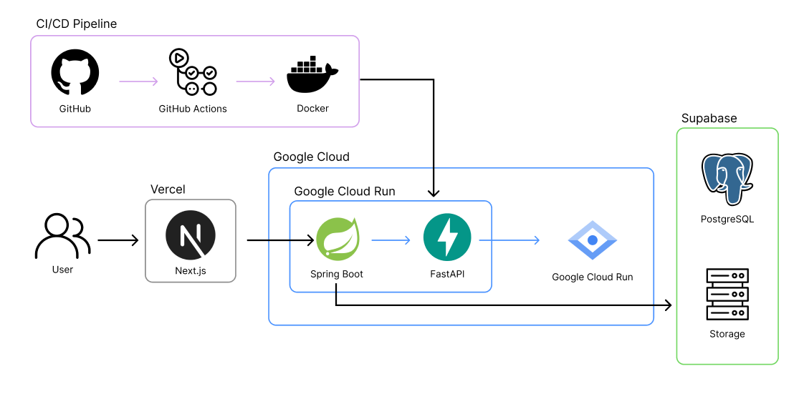
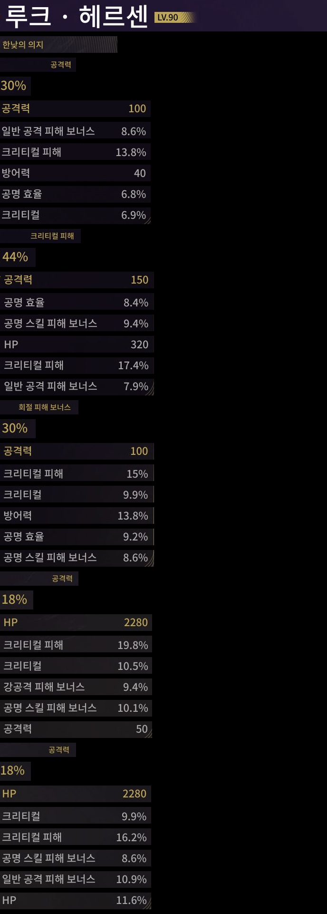

# 명조: 워더링 웨이브 스펙 계산기 서비스

> 《명조: 워더링 웨이브》 캐릭터 프로필 이미지에서 텍스트를 추출해 최종 스펙을 계산해주는 개인 서비스

📅 개발 기간: 2026.05 ~ Present (배포 완료)<br>
👤 인원: 1명 (기획 · 설계 · 개발 · 배포 전 과정 개인 진행)

<!-- 데모 스크린샷 또는 GIF를 여기에 추가하세요 -->
<!--  -->

<br>

## 목차

- [프로젝트 개요](#프로젝트-개요)
- [제약사항](#제약사항)
- [기술 스택](#기술-스택)
- [아키텍처](#아키텍처)
- [트러블슈팅](#트러블슈팅)
- [회고](#회고)

<br>

## 프로젝트 개요

**문제 정의**

- 캐릭터 스펙 조회가 게임 실행을 전제로 하기 때문에, 게임을 켤 수 없는 환경에서는 정보에 접근할 수 없습니다.

**해결 방안**

- 게임 데이터에 직접 접근할 수 없으므로, 공식 디스코드에 공유되는 프로필 이미지에서 캐릭터 정보를 추출해 저장함으로써 스펙을 조회할 수 있게 했습니다.

**핵심 기능**

1. 캐릭터 등록
   - 사용자는 캐릭터 이미지를 업로드합니다.
   - 서비스는 이미지 정보를 분석하여 캐릭터를 등록합니다.
2. 캐릭터 목록 조회
   - 사용자는 등록된 캐릭터 목록을 조회합니다.
   - 서비스는 카드 형태로 캐릭터의 이미지와 이름을 제공합니다.
3. 캐릭터 상세 스펙 조회
   - 사용자는 특정 캐릭터를 선택합니다.
   - 서비스는 해당 캐릭터의 상세 스펙 정보를 제공합니다.
4. 등록된 캐릭터 삭제
   - 사용자는 등록된 캐릭터를 삭제합니다.
   - 서비스는 해당 캐릭터 정보를 제거합니다.

<br>

## 제약사항

- 《명조: 워더링 웨이브》는 게임 IP 특성상 상업적 확장이 제한되어, 처음부터 **개인 사용 목적의 소규모 서비스**로 범위를 한정하고 **무료 인프라만으로 운영**하는 것을 전제로 설계했습니다.
- 이 제약이 이후 기술 스택 선택(무료 티어 중심의 인프라 구성)과 아키텍처 설계(무료 API 할당량 최적화) 전반에 영향을 주었습니다.

<br>

## 기술 스택

| 구분       | 스택                                                  |
| ---------- | ----------------------------------------------------- |
| 프론트엔드 | Next.js                                               |
| 백엔드     | Spring Boot · FastAPI · PostgreSQL · Supabase · MinIO |
| 인프라     | Docker · Vercel · Google Cloud Run                    |
| CI/CD      | GitHub Actions                                        |

**선택 이유**

Spring Boot + FastAPI를 함께 사용한 이유

> Spring Boot는 컨트롤러 - 서비스 - 레포지토리로 계층이 명확히 분리되어 있어 유지보수가 쉽다고 판단해 도메인 로직을 담당하도록 선택했습니다. <br>
> FastAPI는 Python 기반이라 이미지 전처리, 텍스트 전처리, 템플릿 매칭 작업에 특화되어 있다고 판단해, 이미지 분석이 필요한 영역을 전담하도록 역할을 나눴습니다.

PostgreSQL을 선택한 이유

> 설계 초기 스펙 계산 로직을 DB 연산 함수로 처리하는 것도 고려했고, MySQL보다 PostgreSQL이 이런 계산용 함수 지원이 더 잘 되어 있다는 점을 근거로 선택했습니다. <br>
> 다만 실제 구현 단계에서는 계산 로직 전체를 Spring Boot 애플리케이션 레이어에서 처리하게 되어, 이 장점을 충분히 활용하지는 못했습니다. (자세한 내용은 [회고](#회고) 참고)

Supabase를 선택한 이유

> 무료 플랜을 제공하고 PostgreSQL 기반이라 코드 수정 없이 연동할 수 있다는 점에서 선택했습니다. 또한 Supabase는 DB와 스토리지까지 하나의 플랫폼에서 함께 제공해서, 이미지 저장까지 별도 인프라 없이 같은 곳에서 관리할 수 있다는 점도 선택 이유였습니다.

MinIO를 선택한 이유

> 초기에는 AWS S3 사용을 고려해, S3 호환 API를 제공하는 MinIO를 선택했습니다. Docker 이미지로 관리할 수 있어 이미지나 이미지 이름 변경이 잦은 개발 단계에 적합하다고 판단했습니다.

Google Cloud Run + Vercel 조합을 선택한 이유

> Vercel은 Next.js와 궁합이 좋아 선택했습니다. <br>
> Google Cloud Run은 Google Vision API 키를 별도로 업로드하지 않고 백엔드 서버까지 같은 Google 인프라 안에서 함께 관리할 수 있다는 점에서 선택했습니다. <br>
> 두 서비스 모두 무료 플랜을 제공한다는 점도 중요한 선택 이유였습니다.

<br>

## 아키텍처



<br>

## 트러블슈팅

### Google Vision API 호출 최적화 (7회 → 1회)

**문제 상황**<br>
요청 1건당 Vision API를 7번 호출하는 구조였고, 이는 월 무료 할당량(1,000건)을 빠르게 소진할 위험이 있었습니다.

**최종 선택**<br>
필요한 텍스트가 담긴 구역만 잘라내고, 구역 간 순서를 유지한 채 세로로 병합해 한 장의 이미지로 만든 뒤 Vision API를 한 번만 호출하도록 개선했습니다.

**결과**<br>
API 호출 횟수 7회 → 1회로 단축, 무료 할당량 내에서 안정적으로 운영 가능해졌습니다.

<table border="0">
  <tr>
    <td align="center" valign="middle" style="border: none;">
      
    </td>
    <td align="center" valign="middle" style="border: none;">
      <strong style="font-size: 30px;">➡️</strong>
    </td>
    <td align="center" valign="middle" style="border: none;">
      
    </td>
  </tr>
</table>

이미지에서 필요한 영역(`RECTANGLES`)만 잘라낸 뒤, 가장 넓은 폭에 맞춰 여백을 채우고 세로로 이어 붙여 한 장의 이미지로 병합합니다. 이렇게 만든 단일 이미지로 Vision API를 한 번만 호출합니다.

---

### 스토리지 추상화 설계

**문제 상황**<br>
운영 환경은 AWS S3를 계획했으나, 개발 단계에서 동일한 코드로 다른 스토리지를 사용해야 하는 상황이었습니다.

**최종 선택**<br>
S3 호환 API를 제공하는 MinIO를 개발 스토리지로 채택했습니다. 하지만 이후 무료 플랜의 Supabase Storage를 알게 되면서 공통 인터페이스를 정의해 Spring Profile(dev/prod)에 따라 MinIO/Supabase 구현체가 자동 주입되도록 설계했습니다.

**결과**<br>
환경별 스토리지 전환을 코드 수정 없이 처리할 수 있습니다. (dev: MinIO, prod: Supabase 사용 중)

```java
public interface ObjectStorageService {
    String createUrl(String path);
    String uploadProfileImage(MultipartFile file);
}
```

```java
@Profile("dev")
public class MinioObjectStorageService implements ObjectStorageService {

    @Override
    public String uploadProfileImage(MultipartFile file) {
        StorageUtil.validateImage(file);
        String objectName = UUID.randomUUID() + StorageUtil.getExtension(file);

        minioClient.putObject(PutObjectArgs.builder()
                .bucket(profileBucket)
                .object(objectName)
                .stream(file.getInputStream(), file.getSize(), -1)
                .contentType(file.getContentType())
                .build()
        );

        return endpoint + "/" + profileBucket + "/" + objectName;
    }
}
```

```java
@Profile("prod")
public class SupabaseStorageService implements ObjectStorageService {

    @Override
    public String uploadProfileImage(MultipartFile file) {
        StorageUtil.validateImage(file);
        String objectName = UUID.randomUUID() + StorageUtil.getExtension(file);

        supabaseRestClient.post()
                .uri("/storage/v1/object/" + profileBucket + "/" + objectName)
                .contentType(MediaType.parseMediaType(file.getContentType()))
                .header("x-upsert", "true")
                .body(file.getBytes())
                .retrieve()
                .toBodilessEntity();

        return createUrl(profileBucket + "/" + objectName);
    }
}
```

동일한 `ObjectStorageService` 인터페이스를 두고, `@Profile`로 구현체를 분기해 Spring이 실행 환경(dev/prod)에 맞는 구현체를 자동 주입하도록 했습니다. 덕분에 서비스 로직에서는 어떤 스토리지를 쓰는지 신경 쓰지 않고 인터페이스만 호출하면 됩니다.

---

### PATCH API N+1 문제 해결

**문제 상황**<br>
캐릭터 정보 하나를 업데이트할 때 연관된 서브 엔티티가 5번 개별 쿼리로 조회되는 N+1 문제가 있었고, 응답 시간이 875ms였습니다.

**원인 분석**<br>
전체 처리 시간을 단계별로 쪼개어 측정한 결과, 조회 로직이 가장 큰 병목임을 수치로 확인했습니다.

**최종 선택**<br>
`default_batch_fetch_size`를 적용해, 연관 엔티티를 개별 쿼리로 하나씩 조회하는 대신 지정한 크기만큼 묶어서 `IN` 절로 한 번에 조회하도록 개선했습니다.

**결과**<br>
응답 시간을 875ms → 579ms로 단축했습니다. (약 34% 개선)

```yaml
jpa:
  properties:
    hibernate:
      default_batch_fetch_size: 100
```

---

### POST API 응답 지연 개선

**문제 상황**<br>
최종 스펙 계산 후처리 과정에 3.7초가 소요됐고, 그중 25개 데이터를 저장하는 작업이 전체의 48%(1.77초)를 차지하는 병목이었습니다.

**원인 분석**<br>
전체 처리 시간을 단계별로 쪼개어 측정한 결과, 저장 로직이 가장 큰 병목임을 수치로 확인했습니다.

**최종 선택**<br>
ID 생성 방식을 IDENTITY에서 SEQUENCE로 변경하고 batch insert를 적용했습니다.

**결과**<br>
DB 저장 처리 시간을 1.77초 → 0.07초로 단축했습니다. (약 96% 단축)

```yaml
jpa:
  properties:
    hibernate:
      jdbc:
        batch_size: 50
        order_inserts: true
        order_updates: true
```

```sql
CREATE SEQUENCE IF NOT EXISTS user_echo_sub_seq
    START WITH 1
    INCREMENT BY 50
    CACHE 50;

CREATE TABLE IF NOT EXISTS user_echo_sub (
    id BIGINT PRIMARY KEY DEFAULT nextval('user_echo_sub_seq'),
    type VARCHAR(50) NOT NULL,
    value NUMERIC(7,1) NOT NULL,
    user_echo_id BIGINT NOT NULL,
    is_deleted BOOLEAN NOT NULL DEFAULT FALSE,
    CONSTRAINT fk_echo_sub FOREIGN KEY (user_echo_id) REFERENCES user_echoes(id)
);
```

각 테이블마다 `INCREMENT BY 50`으로 설정한 시퀀스를 두어, ID를 저장 시점이 아니라 애플리케이션에서 미리 할당받아 사용하도록 했습니다. `INCREMENT BY`와 `CACHE` 값을 위 `hibernate.jdbc.batch_size`(50)와 맞춰, 한 번에 배치로 묶이는 INSERT 건수만큼 ID를 미리 확보해두는 방식입니다. IDENTITY 전략은 insert 시점에 DB가 직접 ID를 채번해야 해서 매 건마다 즉시 flush가 발생해 batch insert가 불가능했는데, SEQUENCE 전략으로 바꾸면서 이 제약이 사라져 batch insert를 적용할 수 있게 됐습니다.

<br>

## 회고

**기술 선택 재검토**

PostgreSQL은 초기에 스펙 계산용 함수 지원이 강점이라 판단해 선택했지만, 실제 구현 과정에서는 계산 로직이 전부 Spring Boot 애플리케이션 레이어로 옮겨가면서 그 장점을 살리지 못했습니다.<br>
기술 선택의 근거가 실제 구현 방향과 어긋날 수 있다는 걸 경험한 사례였고, 앞으로는 설계 초기에 "이 장점을 실제로 어느 레이어에서 활용할 것인지"까지 구체적으로 정하고 선택하려고 합니다.
