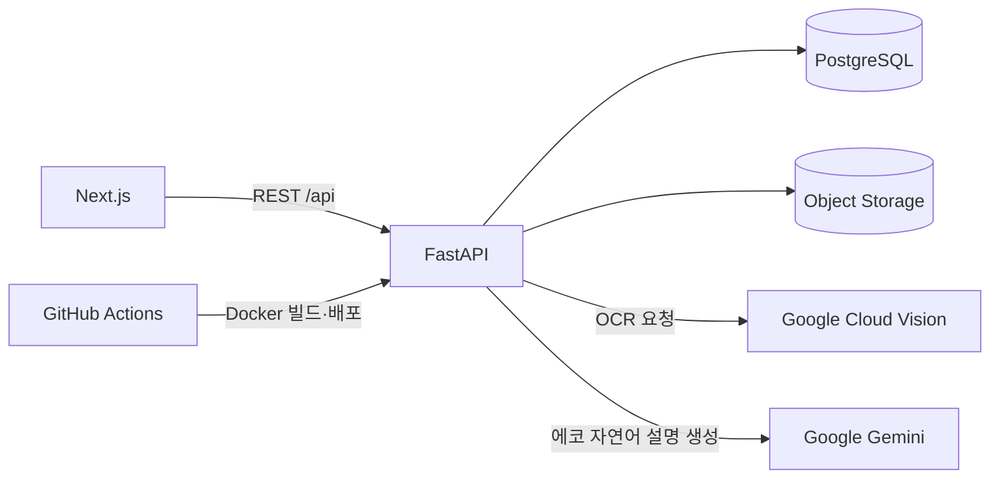
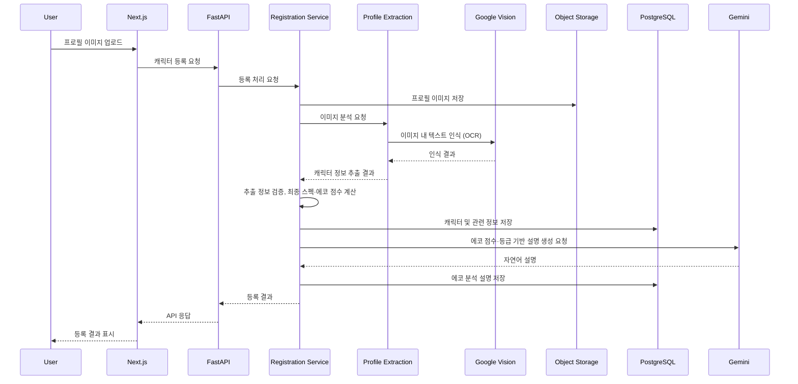

# WaveSync-BE

《명조: 워더링 웨이브》 캐릭터 스펙 계산 웹 서비스의 백엔드(FastAPI) 저장소입니다.

---

## 프로젝트 소개

게임을 실행하지 않고도 캐릭터의 최종 스펙과 에코 정보를 확인할 수 있도록, 프로필 이미지를 분석해 캐릭터 정보를 등록하고 최종 스펙과 에코 점수를 계산합니다.

### 게임 도메인

README에 나오는 게임 용어입니다.

| 용어                       | 설명                                                       |
| -------------------------- | ---------------------------------------------------------- |
| 공명자 (Resonator)         | 이 프로젝트의 "캐릭터"에 해당하는 코드 용어                |
| 에코 (Echo)                | 캐릭터에 장착하는 장비 아이템                              |
| 서브속성                   | 에코가 가지는 보조 능력치. 에코 점수 계산의 대상           |
| 무기 재련 단계             | 무기의 강화 단계(1~5). 단계에 따라 무기 효과가 달라짐      |
| 공명 노드 (Resonance Node) | 캐릭터를 강화하는 항목. 활성화한 노드가 최종 스펙에 반영됨 |
| 돌파 (Resonance Chain)     | 캐릭터의 강화 단계 횟수                                    |

### 주요 기능

| 기능             | 설명                                                     | API                                        |
| ---------------- | -------------------------------------------------------- | ------------------------------------------ |
| 캐릭터 등록      | 프로필 이미지 분석 후 캐릭터 정보 저장                   | `POST /api/resonators`                     |
| 캐릭터 목록 조회 | 등록된 캐릭터를 카드 형태로 조회                         | `GET /api/resonators`                      |
| 캐릭터 상세 조회 | 캐릭터, 무기, 최종 스펙 확인                             | `GET /api/resonators/{id}`                 |
| 설정 조회·수정   | 무기 강화 단계·공명 노드 확인과 변경 및 최종 스펙 재계산 | `GET`·`PATCH /api/resonators/{id}/setting` |
| 에코 조회        | 에코 서브속성 점수·등급과 분석 설명 확인                 | `GET /api/resonators/{id}/echo`            |
| 캐릭터 삭제      | 등록된 캐릭터 및 관련 데이터 삭제                        | `DELETE /api/resonators`                   |

---

## 기술 스택과 시스템 구성

| 구분           | 기술                                   | 역할                                                   |
| -------------- | -------------------------------------- | ------------------------------------------------------ |
| Frontend       | Next.js (Vercel 배포)                  | 사용자 인터페이스, 백엔드 API 호출                     |
| Backend        | FastAPI (Docker, Google Cloud Run)     | API 처리, 비즈니스 로직, 데이터 관리                   |
| Database       | PostgreSQL (운영: Supabase)            | 캐릭터 및 관련 데이터 저장                             |
| Object Storage | MinIO (로컬) / Supabase Storage (운영) | 프로필 이미지와 기준 데이터 이미지 저장                |
| OCR            | Google Cloud Vision API                | 프로필 이미지 텍스트 추출                              |
| LLM            | Google Gemini API                      | 에코 분석 자연어 설명 생성                             |
| CI/CD          | GitHub Actions                         | `main`의 `fastapi/` 변경 시 이미지 빌드·Cloud Run 배포 |


```mermaid
flowchart LR
    FE["Next.js"] -->|REST /api| BE["FastAPI"]
    BE --> DB[("PostgreSQL")]
    BE --> ST[("Object Storage")]
    BE -->|OCR 요청| VI["Google Cloud Vision"]
    BE -->|에코 자연어 설명 생성| GM["Google Gemini"]
    GH["GitHub Actions"] -->|Docker 빌드·배포| BE
```

운영 환경의 DB 연결 정보와 Cloud Run 환경 변수는 이 저장소에 없습니다. 배포 워크플로우는 이미지 빌드와 `gcloud run deploy`만 수행합니다.

---

## 백엔드 구조

백엔드는 캐릭터 도메인과 프로필 이미지 분석을 중심으로 구성되어 있습니다.

`resonator/`는 캐릭터 데이터와 스펙 계산을 담당하는 도메인이고, `user_resonator/`는 사용자가 등록한 캐릭터를 관리합니다.

### 프로젝트 디렉터리

```text
WaveSync-BE/
├── fastapi/
│   ├── app/
│   │   ├── main.py
│   │   ├── config/
│   │   ├── db/
│   │   ├── exceptions/
│   │   ├── schemas/
│   │   ├── storage/
│   │   ├── profile_extraction/
│   │   │   ├── ocr/
│   │   │   └── echo/
│   │   └── resonator/
│   │       ├── router.py
│   │       ├── *_service.py
│   │       ├── master/
│   │       ├── resonance_node/
│   │       ├── user_resonator/
│   │       └── echo_score/
│   ├── images/template/
│   ├── credentials/
│   ├── .env
│   ├── requirements.txt
│   ├── pyproject.toml
│   └── Dockerfile
│
├── infra/
│   ├── docker-compose.yml
│   └── postgres/
│
└── .github/workflows/
    └── deploy-fastapi.yml
```

### 코드 탐색 가이드

처음 읽는다면 `main.py`에서 앱 구성을 확인한 뒤 `router.py` → `resonator_registration_service.py` 순서로 요청 진입점과 캐릭터 등록 흐름을 확인하는 것을 권장합니다.

이후 수정하려는 기능에 따라 해당 모듈을 확인합니다.

| 작업                    | 우선 확인할 위치                                                    |
| ----------------------- | ------------------------------------------------------------------- |
| 캐릭터 등록             | `resonator/resonator_registration_service.py`                       |
| 캐릭터 조회·수정·삭제   | `resonator/resonator_service.py`                                    |
| 최종 스펙 계산          | `resonator/spec_calculation_service.py`                             |
| 에코 서브속성 점수·등급 | `resonator/echo_score/`                                             |
| 이미지 OCR 및 파싱      | `profile_extraction/`                                               |
| API 요청 및 응답 변경   | `resonator/router.py`, `resonator/schemas.py`                       |
| 데이터 조회 및 저장     | 각 도메인의 `*_repository.py`와 모델 (`master/`, `user_resonator/`) |
| 이미지 저장 방식 변경   | `storage/`                                                          |

---

## 주요 요청 흐름

### 캐릭터 등록

`POST /api/resonators`


```mermaid
sequenceDiagram
    participant U as User
    participant F as Next.js
    participant R as FastAPI
    participant S as Registration Service
    participant P as Profile Extraction
    participant V as Google Vision
    participant O as Object Storage
    participant D as PostgreSQL
    participant G as Gemini

    U->>F: 프로필 이미지 업로드
    F->>R: 캐릭터 등록 요청
    R->>S: 등록 처리 요청

    S->>O: 프로필 이미지 저장
    S->>P: 이미지 분석 요청
    P->>V: 이미지 내 텍스트 인식 (OCR)
    V-->>P: 인식 결과
    P-->>S: 캐릭터 정보 추출 결과

    S->>S: 추출 정보 검증, 최종 스펙·에코 점수 계산
    S->>D: 캐릭터 및 관련 정보 저장

    S->>G: 에코 점수·등급 기반 설명 생성 요청
    G-->>S: 자연어 설명
    S->>D: 에코 분석 설명 저장

    S-->>R: 등록 결과
    R-->>F: API 응답
    F-->>U: 등록 결과 표시
```

등록 처리는 `resonator/resonator_registration_service.py`의 `create_resonator`가 조율하며, 각 단계의 실제 로직은 다른 모듈에 위임합니다.

추출한 값이 기준 데이터에 없으면 검증 단계에서 등록이 실패합니다.

---

## 외부 서비스

### OCR

Google Cloud Vision API로 프로필 이미지에서 텍스트를 추출합니다. 이미지 전처리와 결과 파싱은 `profile_extraction/`이 담당합니다.

- Vision API는 등록 요청 1건당 1회만 호출합니다.
- 프로필 이미지에서 캐릭터 이름, 무기 이름, 에코 옵션 영역을 분리한 뒤 세로로 병합해 하나의 이미지로 요청합니다.
- Vision 응답의 단어를 줄 단위로 병합하고 정제한 뒤, 병합 순서에 따라 캐릭터 이름, 무기 이름, 에코 옵션 줄로 나눕니다.

### LLM

Google Gemini API를 사용해 에코 점수·등급 결과를 자연어 설명으로 생성합니다. 기본 모델은 `gemini-3.8-flash`이며 `GEMINI_MODEL`로 변경할 수 있습니다.

- 점수와 등급은 백엔드가 직접 계산하고, LLM은 계산이 끝난 결과를 설명하는 데에만 사용합니다.
- 캐릭터 등록 1건당 최대 1회 호출하며, DB 커밋 이후에 호출합니다.
- 점수가 계산된 에코가 없는 캐릭터와 `GEMINI_API_KEY`가 없는 경우에는 호출하지 않습니다.
- 타임아웃은 15초이며 자동 재시도는 하지 않습니다.
- 호출 실패, 빈 응답, 너무 긴 응답은 저장하지 않습니다.
- LLM 호출에 실패해도 캐릭터 등록 결과에는 영향을 주지 않고 에코 설명만 비어 있습니다.
- 생성한 설명은 캐릭터 단위로 저장되어 에코 조회 응답의 `echoAnalysis`로 반환됩니다.

---

## 로컬 개발 환경

### 사전 요구사항

- Docker 및 Docker Compose v2.24 이상
- `WaveSync-tools` 저장소
  - 무기·캐릭터·에코 이미지 원본을 보관합니다.
  - `WaveSync-BE`와 같은 상위 폴더에 있어야 합니다.
  - `minio-init`이 `resources/images/` 아래 이미지를 MinIO에 시드로 업로드합니다.
- Python 3.13
  - 컨테이너 없이 직접 실행하는 경우에만 필요합니다.

### 인증 정보

| 항목                       | 위치                                                             | 필수 여부          | 없을 때                        |
| -------------------------- | ---------------------------------------------------------------- | ------------------ | ------------------------------ |
| Vision 서비스 계정 키 파일 | `fastapi/credentials/concrete-flare-495107-c0-0ed9cd7b1ce6.json` | 캐릭터 등록에 필수 | 캐릭터 등록(OCR)이 실패함      |
| Gemini API 키              | `fastapi/.env`의 `GEMINI_API_KEY`                                | 선택               | 에코 분석 설명만 생성되지 않음 |

- Vision 키 파일은 `APP_ENV=dev`일 때 위 경로에서 읽습니다. 그 외 환경에서는 Application Default Credentials를 사용합니다.
- 두 인증 정보 모두 서버 기동 자체에는 필요하지 않습니다.

### 환경 변수

로컬 실행에 필요한 값은 `infra/docker-compose.yml`에 이미 들어 있습니다. 추가로 설정하는 값은 `fastapi/.env`에 둡니다. 파일이 없어도 실행할 수 있습니다.

| 변수                                   | 위치            | 용도                                          |
| -------------------------------------- | --------------- | --------------------------------------------- |
| `APP_ENV`                              | compose (`dev`) | `dev`는 MinIO, `prod`는 Supabase Storage 사용 |
| `DATABASE_URL`                         | compose         | PostgreSQL 연결 정보                          |
| `MINIO_*`                              | compose         | MinIO 접속 정보와 버킷 이름                   |
| `GEMINI_API_KEY`, `GEMINI_MODEL`       | `fastapi/.env`  | 에코 분석 설명 생성                           |
| `SUPABASE_URL`, `SUPABASE_SERVICE_KEY` | 운영 환경       | Supabase Storage 연결 (`APP_ENV=prod`)        |

저장소에 환경 변수 예시 파일은 없습니다.

`fastapi/.env`와 `fastapi/credentials/`는 `fastapi/.gitignore`에 등록되어 Git 추적에서 제외되므로 커밋하지 않습니다.

### 실행

Compose 파일이 `infra/`에 있으므로 해당 폴더에서 실행합니다.

```bash
cd infra
docker compose up
```

| 서비스       | 주소 / 동작                                                                      |
| ------------ | -------------------------------------------------------------------------------- |
| `fastapi`    | `http://localhost:8000` · 코드 변경 시 자동 리로드 · API 명세는 `/docs`에서 확인 |
| `postgres`   | `localhost:5432` · 최초 기동 시 `infra/postgres/*.sql`이 순서대로 실행           |
| `minio`      | API `localhost:9000` · 콘솔 `http://localhost:9001`                              |
| `minio-init` | 버킷 생성과 시드 이미지 업로드 후 종료                                           |

DB를 초기화하려면 다음 명령으로 볼륨을 삭제한 뒤 다시 실행합니다.

```bash
docker compose down -v
docker compose up
```

초기화 SQL은 DB 볼륨이 비어 있을 때만 실행됩니다.
