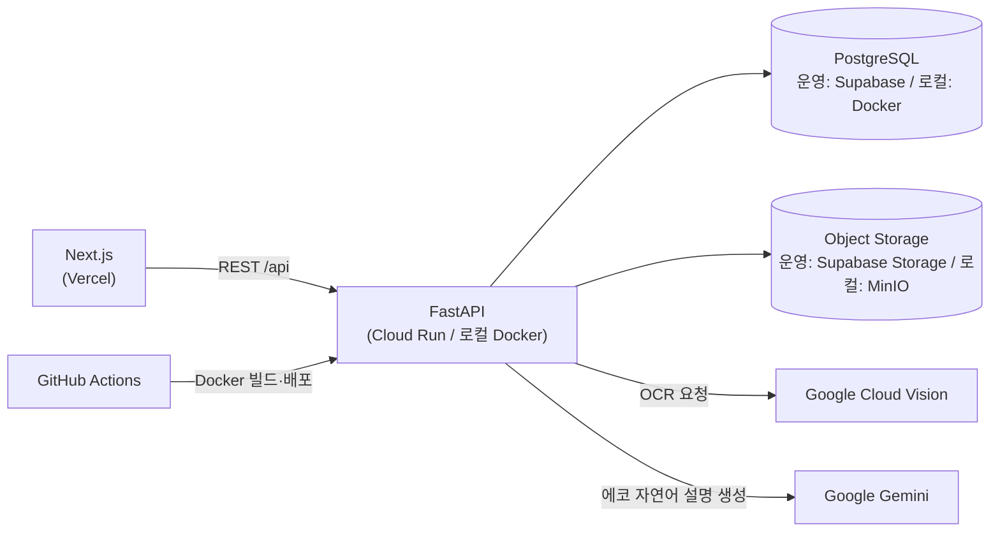
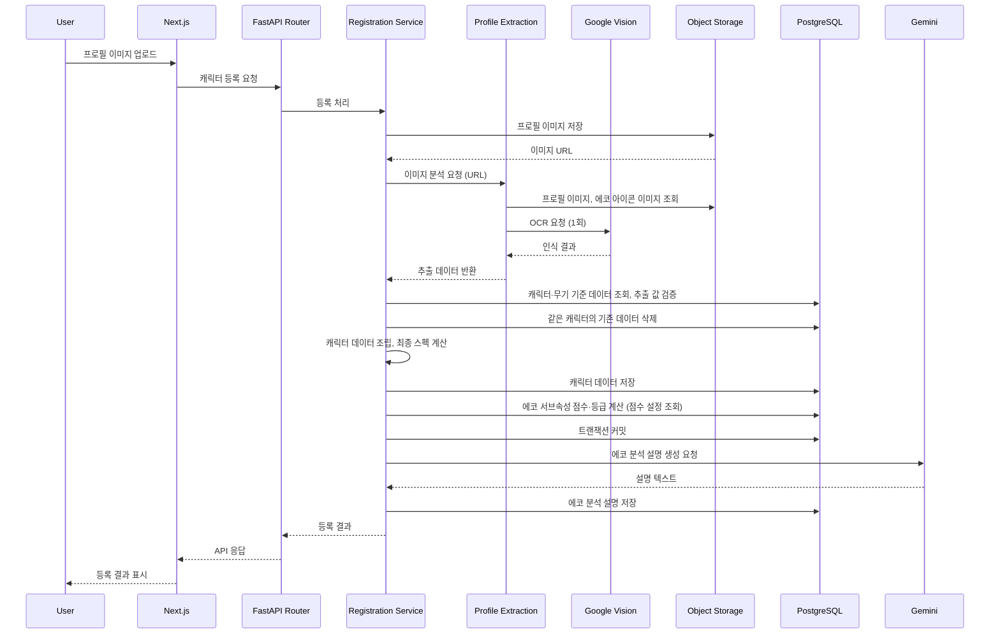

# WaveSync-BE

《명조: 워더링 웨이브》 캐릭터의 프로필 이미지를 분석해 최종 스펙과 에코 정보를 확인할 수 있는 웹 서비스입니다.

---

## 프로젝트 소개

게임을 실행하지 않고도 캐릭터 스펙을 확인할 수 있도록 만든 서비스입니다. 처리 흐름은 다음과 같습니다.

1. 공식 디스코드 공유 기능으로 만든 프로필 이미지를 업로드합니다.
2. 이미지에서 캐릭터·무기·에코 정보를 추출해 저장합니다.
3. 추출한 정보로 최종 스펙과 에코 점수를 계산합니다.

이 저장소는 위 과정을 처리하는 백엔드(FastAPI)입니다.

> **에코**는 캐릭터에 장착하는 장비 아이템으로, **서브속성**이라 부르는 보조 능력치를 가집니다.

### 주요 기능

| 기능             | 설명                                                                                    | API                                        |
| ---------------- | --------------------------------------------------------------------------------------- | ------------------------------------------ |
| 캐릭터 등록      | 프로필 이미지에서 캐릭터·무기·에코 정보를 추출하고, 최종 스펙과 에코 서브속성 점수 계산 | `POST /api/resonators`                     |
| 캐릭터 목록 조회 | 등록된 캐릭터를 카드 형태로 조회                                                        | `GET /api/resonators`                      |
| 캐릭터 상세 조회 | 캐릭터, 무기, 최종 스펙 확인                                                            | `GET /api/resonators/{id}`                 |
| 설정 조회·수정   | 무기 재련 단계·공명 노드(캐릭터 강화 항목) 확인과 변경 (최종 스펙 재계산)               | `GET`·`PATCH /api/resonators/{id}/setting` |
| 에코 조회        | 에코 서브속성 점수·등급과 분석 설명 확인                                                | `GET /api/resonators/{id}/echo`            |
| 캐릭터 삭제      | 등록된 캐릭터 및 관련 데이터 삭제                                                       | `DELETE /api/resonators`                   |

---

## 기술 스택과 시스템 구성

| 구분           | 기술                                   | 역할                                                             |
| -------------- | -------------------------------------- | ---------------------------------------------------------------- |
| Frontend       | Next.js (Vercel 배포)                  | 사용자 인터페이스, 백엔드 API 호출                               |
| Backend        | FastAPI (Docker, Google Cloud Run)     | API 처리, 비즈니스 로직, 데이터 관리                             |
| Database       | PostgreSQL (운영: Supabase)            | 캐릭터 및 관련 데이터 저장                                       |
| Object Storage | MinIO (로컬) / Supabase Storage (운영) | 프로필 이미지와 기준 데이터 이미지 저장. `APP_ENV`로 구현체 선택 |
| OCR            | Google Cloud Vision API                | 프로필 이미지 텍스트 추출                                        |
| LLM            | Google Gemini API                      | 에코 분석 자연어 설명 생성                                       |
| CI/CD          | GitHub Actions                         | `main`의 `fastapi/` 변경 시 이미지 빌드·Cloud Run 배포           |


```mermaid
flowchart LR
    FE["Next.js<br/>(Vercel)"] -->|REST /api| BE["FastAPI<br/>(Cloud Run / 로컬 Docker)"]
    BE --> DB[("PostgreSQL<br/>운영: Supabase / 로컬: Docker")]
    BE --> ST[("Object Storage<br/>운영: Supabase Storage / 로컬: MinIO")]
    BE -->|OCR 요청| VI["Google Cloud Vision"]
    BE -->|에코 자연어 설명 생성| GM["Google Gemini"]
    GH["GitHub Actions"] -->|Docker 빌드·배포| BE
```

- 운영 환경의 DB 연결 정보와 Cloud Run 환경 변수는 이 저장소에 없습니다 (배포 워크플로우는 이미지 빌드와 `gcloud run deploy`만 수행).
- 단계별 호출 순서는 [주요 요청 흐름](#주요-요청-흐름)을 참고합니다.

---

## 백엔드 구조

백엔드는 캐릭터 도메인과 프로필 이미지 분석을 중심으로 구성되어 있습니다. 코드에서는 캐릭터를 `resonator`(공명자)라는 이름으로 사용하므로, `resonator/`는 캐릭터 데이터와 스펙 계산을 담당하는 도메인이고 `user_resonator/`는 사용자가 등록한 캐릭터를 뜻합니다.

### 프로젝트 디렉터리

```text
WaveSync-BE/
├── fastapi/
│   ├── app/
│   │   ├── main.py                  # 앱 생성, CORS, 라우터·예외 핸들러 등록
│   │   ├── config/                  # 로거
│   │   ├── db/                      # SQLAlchemy Base, 세션
│   │   ├── exceptions/              # 커스텀 예외, 에러 코드, 전역 예외 핸들러
│   │   ├── schemas/                 # 공통 API 응답 래퍼
│   │   ├── storage/                 # 이미지 저장소 (MinIO / Supabase Storage)
│   │   ├── profile_extraction/      # 프로필 이미지에서 데이터 추출
│   │   │   ├── ocr/                 #   영역 크롭·병합, Vision 호출, 텍스트 정제
│   │   │   └── echo/                #   에코 아이콘 이미지 매칭, 에코 텍스트 파싱
│   │   └── resonator/               # 핵심 도메인
│   │       ├── router.py            #   API 엔드포인트
│   │       ├── *_service.py         #   조회·수정·삭제, 등록, 검증, 스펙 계산
│   │       ├── master/              #   캐릭터(공명자)·무기 기준 데이터
│   │       ├── resonance_node/      #   공명 노드 (캐릭터 강화 항목)
│   │       ├── user_resonator/      #   등록된 캐릭터, 최종 스탯, 에코
│   │       └── echo_score/          #   에코 서브속성 점수 계산과 LLM 설명
│   ├── images/template/             # 돌파(캐릭터 강화 단계) 판별용 템플릿 이미지
│   ├── credentials/                 # Google Vision 서비스 계정 키
│   ├── .env                         # 환경 설정 (Gemini API 키 등)
│   ├── requirements.txt
│   ├── pyproject.toml
│   └── Dockerfile
│
├── infra/
│   ├── docker-compose.yml           # 로컬 실행 (postgres, minio, fastapi)
│   └── postgres/                    # 테이블 생성 및 기준 데이터 SQL (01~05)
│
├── .github/workflows/
│   └── deploy-fastapi.yml           # Cloud Run 배포
│
├── images/                          # 이미지 자료 (README에서는 더 이상 참조하지 않음)
└── README.md
```

### 코드 탐색 가이드

**처음 읽는다면** 다음 순서를 권장합니다.

1. `fastapi/app/main.py` — 앱 생성, 미들웨어, 라우터·예외 핸들러 등록
2. `fastapi/app/resonator/router.py` → `resonator_registration_service.py` — 엔드포인트와 등록 흐름 (아래 [요청 흐름](#주요-요청-흐름)과 함께 읽기)
3. `fastapi/app/profile_extraction/` — 이미지 분석과 OCR
4. `fastapi/app/resonator/` 하위 폴더 — 모델과 repository
5. `infra/`, `fastapi/Dockerfile` — 실행 환경과 배포 설정

**기능을 수정한다면** 다음 위치부터 확인합니다 (`fastapi/app/` 기준).

| 작업                    | 우선 확인할 위치                                                  |
| ----------------------- | ----------------------------------------------------------------- |
| 캐릭터 등록             | `resonator/resonator_registration_service.py`                     |
| 캐릭터 조회·수정·삭제   | `resonator/resonator_service.py`                                  |
| 최종 스펙 계산          | `resonator/spec_calculation_service.py`                           |
| 에코 서브속성 점수·등급 | `resonator/echo_score/`                                           |
| 이미지 OCR 및 파싱      | `profile_extraction/`                                             |
| API 요청 및 응답 변경   | `resonator/router.py`, `resonator/schemas.py`                     |
| 데이터 조회 및 저장     | 각 폴더의 `*_repository.py`와 모델 (`master/`, `user_resonator/`) |
| 이미지 저장 방식 변경   | `storage/`                                                        |

### 주요 요청 흐름

#### 캐릭터 등록

`POST /api/resonators`


```mermaid
sequenceDiagram
    participant U as User
    participant F as Next.js
    participant R as FastAPI Router
    participant S as Registration Service
    participant P as Profile Extraction
    participant V as Google Vision
    participant O as Object Storage
    participant D as PostgreSQL
    participant G as Gemini

    U->>F: 프로필 이미지 업로드
    F->>R: 캐릭터 등록 요청
    R->>S: 등록 처리
    S->>O: 프로필 이미지 저장
    O-->>S: 이미지 URL
    S->>P: 이미지 분석 요청 (URL)
    P->>O: 프로필 이미지, 에코 아이콘 이미지 조회
    P->>V: OCR 요청 (1회)
    V-->>P: 인식 결과
    P-->>S: 추출 데이터 반환
    S->>D: 캐릭터·무기 기준 데이터 조회, 추출 값 검증
    S->>D: 같은 캐릭터의 기존 데이터 삭제
    S->>S: 캐릭터 데이터 조립, 최종 스펙 계산
    S->>D: 캐릭터 데이터 저장
    S->>D: 에코 서브속성 점수·등급 계산 (점수 설정 조회)
    S->>D: 트랜잭션 커밋
    S->>G: 에코 분석 설명 생성 요청
    G-->>S: 설명 텍스트
    S->>D: 에코 분석 설명 저장
    S-->>R: 등록 결과
    R-->>F: API 응답
    F-->>U: 등록 결과 표시
```

- 프로필 이미지를 먼저 저장소에 올리고, 분석 모듈이 그 URL로 이미지를 읽어 OCR을 요청합니다. 상세는 [OCR](#ocr)을 참고합니다.
- 추출한 값이 기준 데이터에 없으면 등록은 검증 단계에서 실패합니다.
- 에코 분석 설명(Gemini)은 마지막 단계이며, 상세는 [LLM](#llm)을 참고합니다.

---

## 외부 서비스

### OCR

Google Cloud Vision API를 사용해 프로필 이미지에서 텍스트를 추출합니다.

이미지 전처리 및 OCR 결과 파싱은 백엔드의 프로필 이미지 분석 모듈에서 담당합니다.

- Vision API는 등록 요청 1건당 1회만 호출합니다. 프로필 이미지에서 캐릭터 이름, 무기 이름, 에코 옵션 영역을 분리해 세로로 병합한 이미지 한 장으로 요청합니다.
- 응답의 단어를 줄 단위로 병합하고 정제한 뒤, 병합 순서에 따라 캐릭터 이름, 무기 이름, 에코 옵션 줄로 나눕니다.

### LLM

Google Gemini API를 사용해 에코 점수·등급 결과를 자연어 설명으로 생성합니다. 기본 모델은 `gemini-3.8-flash`이며 `GEMINI_MODEL`로 바꿀 수 있습니다.

- 점수와 등급은 백엔드가 직접 계산하고, LLM은 계산이 끝난 결과를 설명하는 데에만 사용합니다.
- 캐릭터 등록 1건당 최대 1회 호출하며, DB 커밋 이후에 호출합니다.
- 점수가 계산된 에코가 없는 캐릭터(예: 서포터 역할)와 `GEMINI_API_KEY`가 없는 경우에는 호출하지 않습니다.
- 타임아웃은 15초이고 자동 재시도는 하지 않습니다. 호출 실패, 빈 응답, 너무 긴 응답은 사용하지 않습니다.
- 위 모든 경우에 등록 결과에는 영향이 없고 설명만 비게 됩니다. 생성한 설명은 캐릭터 단위로 저장되어 에코 조회 응답의 `echoAnalysis`로 반환됩니다.

---

## 로컬 개발 환경

### 사전 요구사항

- Docker 및 Docker Compose v2.24 이상 (`env_file`의 `required` 옵션 사용)
- `WaveSync-tools` 저장소: `WaveSync-BE`와 같은 상위 폴더에 있어야 하며, MinIO 초기화 시 `resources/images/` 아래의 무기·캐릭터·에코 이미지를 업로드합니다.
- Python 3.13: 컨테이너 없이 직접 실행하는 경우에만 필요

### 인증 정보

| 항목                       | 위치                                                             | 필수 여부          | 없을 때                                         |
| -------------------------- | ---------------------------------------------------------------- | ------------------ | ----------------------------------------------- |
| Vision 서비스 계정 키 파일 | `fastapi/credentials/concrete-flare-495107-c0-0ed9cd7b1ce6.json` | 캐릭터 등록에 필수 | 캐릭터 등록(OCR)이 실패함                       |
| Gemini API 키              | `fastapi/.env`의 `GEMINI_API_KEY`                                | 선택               | 에코 분석 설명만 생성하지 않고 등록은 정상 처리 |

- Vision 키 파일은 `APP_ENV=dev`일 때 위 경로에서 읽습니다. 그 외 환경에서는 기본 인증(Application Default Credentials)을 사용합니다.
- 두 항목 모두 서버 기동에는 필요하지 않습니다.

### 환경 변수

로컬 실행에 필요한 값은 `infra/docker-compose.yml`에 이미 들어 있습니다. 추가로 설정하는 값은 `fastapi/.env`에 둡니다 (파일이 없어도 실행됩니다).

| 변수                                   | 위치                  | 용도                                                        |
| -------------------------------------- | --------------------- | ----------------------------------------------------------- |
| `APP_ENV`                              | compose (`dev`)       | `dev`는 MinIO와 서비스 계정 키 파일, `prod`는 Supabase 사용 |
| `DATABASE_URL`                         | compose               | PostgreSQL 연결 정보                                        |
| `MINIO_*`                              | compose               | MinIO 접속 정보와 버킷 이름                                 |
| `GEMINI_API_KEY`, `GEMINI_MODEL`       | `fastapi/.env` (선택) | 에코 분석 설명 생성. 키가 없으면 설명 생성만 건너뜀         |
| `SUPABASE_URL`, `SUPABASE_SERVICE_KEY` | 운영 환경             | Supabase Storage 연결 (`APP_ENV=prod`)                      |

저장소에 환경 변수 예시 파일은 없습니다. `fastapi/.env`와 `fastapi/credentials/`는 `fastapi/.gitignore`에 등록되어 Git 추적에서 제외되므로 커밋하지 않습니다.

### 실행

Compose 파일이 `infra/`에 있으므로 해당 폴더에서 실행합니다.

```bash
cd infra
docker compose up
```

| 서비스       | 주소 / 동작                                                             |
| ------------ | ----------------------------------------------------------------------- |
| `fastapi`    | `http://localhost:8000`, 코드 변경 시 자동 리로드                       |
| `postgres`   | `localhost:5432`. 최초 기동 시 `infra/postgres/*.sql`이 순서대로 실행됨 |
| `minio`      | API `localhost:9000`, 콘솔 `http://localhost:9001`                      |
| `minio-init` | 버킷 생성과 시드 이미지 업로드 후 종료                                  |

DB를 초기화하려면 `docker compose down -v`로 볼륨을 지운 뒤 다시 실행합니다. 초기화 SQL은 DB 볼륨이 비어 있을 때만 실행됩니다.
